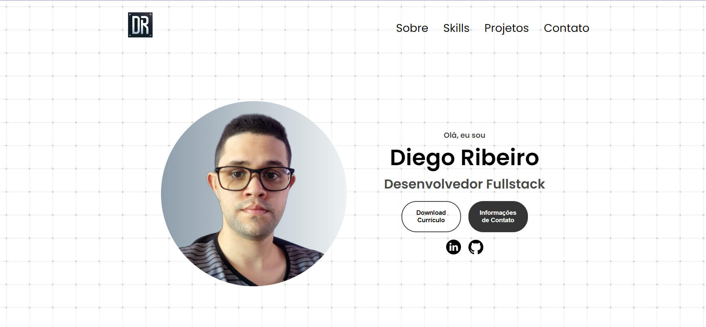
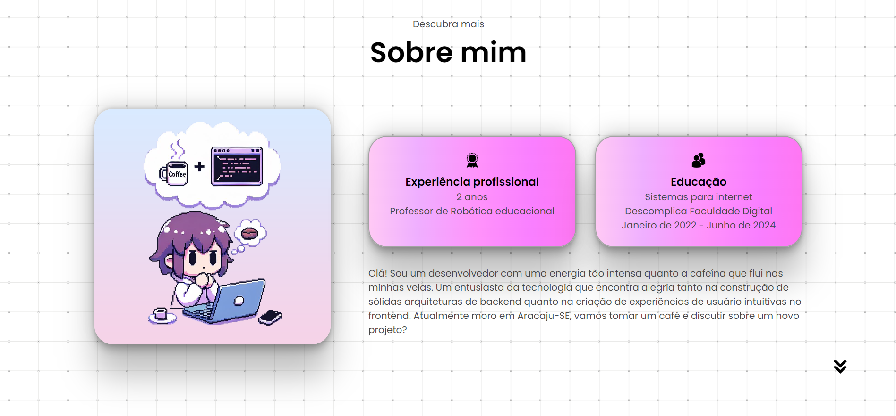
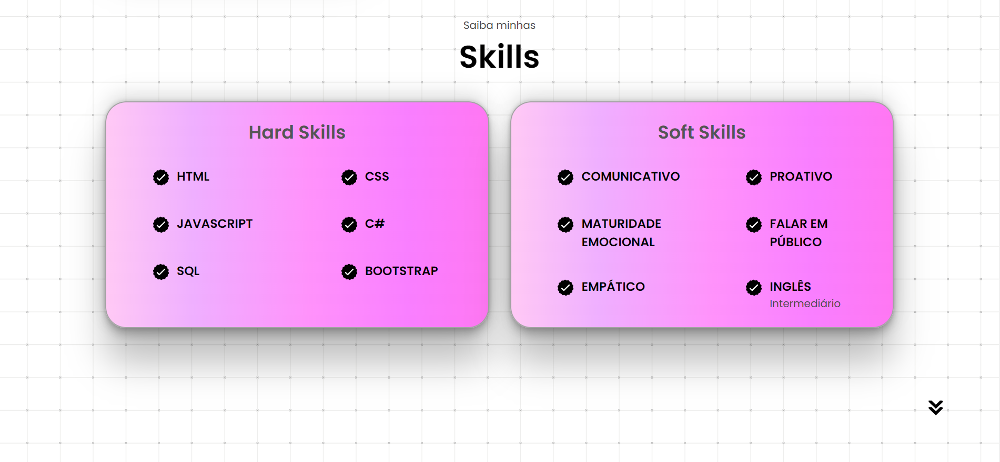
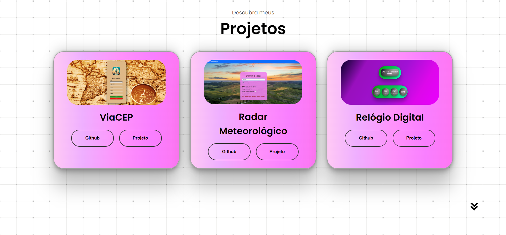
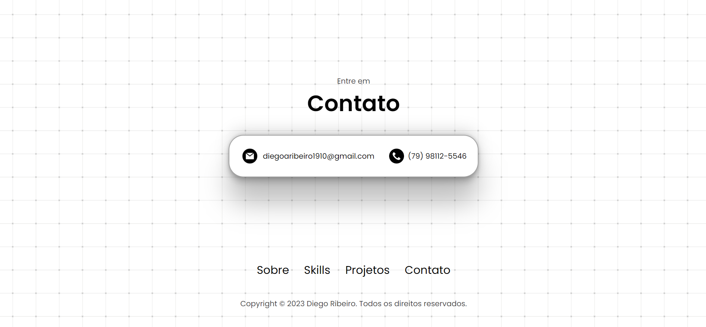

<h1 align="center"> Portfolio DEV </h1>

Projeto desenvolvido no treinamento programador fullstack (Realizado pelo SENAI), do programa Meu Primeiro Emprego.  
<a href="https://primeiroemprego.se.gov.br/" target="_blank">Mais informações sobre o programa Meu Primeiro Emprego.</a>

 
  

Seção Inicial

 
  

Seção Sobre Mim

 
  

Seção das Skills

 
  

Seção dos Projetos

 
  

Seção do Contato

  <a href="https://diegoribeiro.netlify.app/" style="font-weight: bold;" target="_blank">💎 Link para o projeto.</a>

## 🚀 Tecnologias

Esse projeto foi desenvolvido com as seguintes tecnologias:

- HTML
- CSS
- JavaScript
- Git e Github

## 💻 Projeto

O projeto visa criar um portfolio pessoal utilizando os conhecimentos de HTML, CSS e JAVASCRIPT aprendidos em sala. Além disso, foi proposto pelo docente a pesquisa de referências e o desafio de adicionar funcionalidades que destaquem o site dos demais. Dessa forma, pude me desafiar adicionando um background animado, criando uma animação ao abrir o projeto na seção inicial e deixar o site responsivo para telas menores.

## 🔖 Layout

O Layout do projeto foi baseado em um tutorial do Youtube. Sendo que, modificações foram feitas pelo desenvolvedor afim de torna-lo mais pessoal, do seu gosto e condizente com a as demandas passadas em sala pelo professor .
<ul>
<li>link de referência:</li>
<a href="https://www.youtube.com/watch?v=ldwlOzRvYOU">Responsive Portfolio Website From Scratch</a>
</ul>
